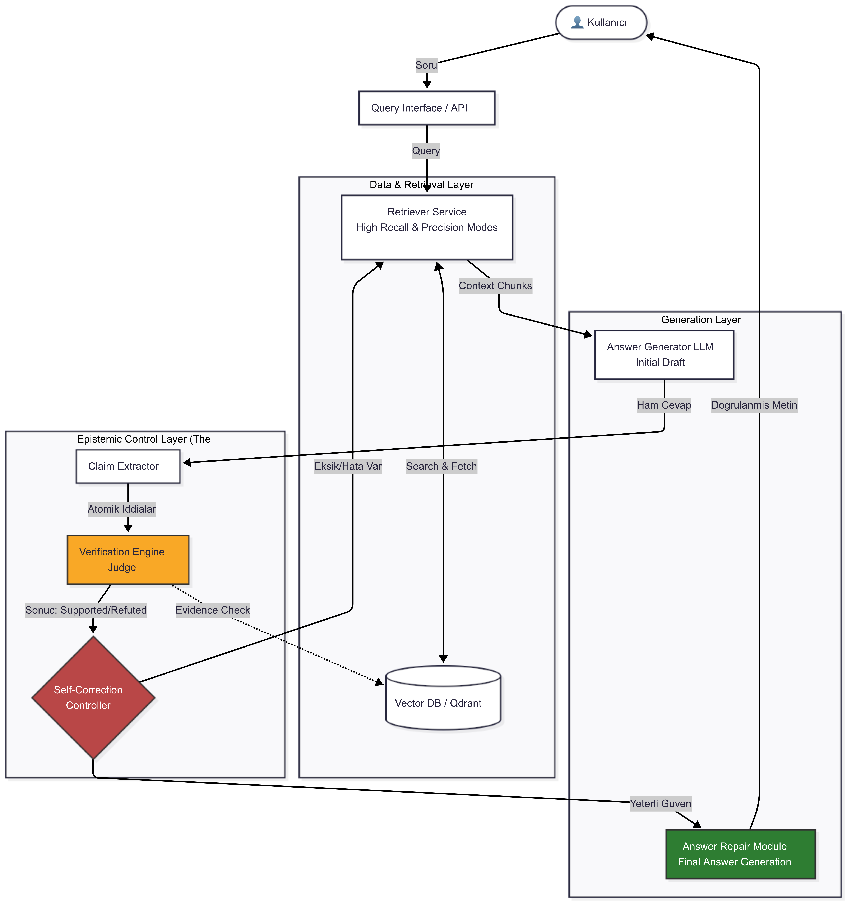

# Self-Correcting RAG

> **Kanıtlanabilir ve savunulabilir cevaplar üreten, kendi kendini düzelten bir RAG sistemi.**

Klasik RAG sistemleri cevap üretir ama doğrulamaz. Bu proje ürettiği her cevabı **iddialara (claims) böler**, her iddiayı **kanıtlarla doğrular** ve gerektiğinde **kendi kendini düzeltir**.

---

## Proje Felsefesi

Bu proje "en hızlı cevap" değil, **kanıtlanabilir ve savunulabilir cevap** üretmeyi hedefler.

| Klasik RAG | Self-Correcting RAG |
|---|---|
| Cevap üretir ve sunar | Cevap üretir, iddialara böler, doğrular |
| LLM'e güvenir | LLM'i sorgular |
| Hallucination kontrolü yok | Claim-level hallucination tespiti |
| Tek geçiş (one-shot) | İteratif, geri beslemeli döngü |

---

## Sistem Mimarisi

Sistem, kullanıcı sorusuna ilk cevabı ürettikten sonra şu adımları izler:
1. Cevap içindeki her bir bağımsız bilgi ifadesini (claim) çıkarır.
2. Her bir iddia için ayrı ayrı ve yüksek kesinlikli (High-Precision) veri araması yapar (Evidence Check).
3. LLM Judge ile kanıtları kıyaslayarak iddiaları supported (desteklendi), refuted (çürütüldü) veya unknown (bilinmiyor) olarak etiketler.
4. Doğrulanamayan iddialar varsa, sadece doğrulanmış bilgilerle cevabı yeniden yazar (Answer Repair).
5. Tüm claimler desteklenemezse, soruyu reformüle edip tekrar dener (Query Rewrite + Retry).



---

## Klasör Yapısı

```
self-correcting-rag/
│
├── app/
│   ├── main.py                 # FastAPI entrypoint (Web UI ve API sunumu)
│   ├── pipeline.py             # Basit RAG pipeline (verification dahil, retry hariç)
│   │
│   ├── static/
│   │   └── index.html          # Web Arayüzü (Glassmorphism Ajan Arayüzü)
│   │
│   ├── core/
│   │   ├── config.py           # Env & model ayarları (pydantic-settings)
│   │   └── logger.py           # Merkezi logging altyapısı
│   │
│   ├── retrieval/
│   │   ├── retriever.py        # QdrantRetriever (High-Recall / High-Precision)
│   │   ├── chunking.py         # Recursive semantic chunking + overlap
│   │   ├── embedder.py         # Sentence Transformers embedding
│   │   └── query_rewriter.py   # LLM ile sorgu reformülasyonu (Retry için)
│   │
│   ├── generation/
│   │   ├── llm.py              # OpenAI API istemcisi (LLMClient)
│   │   ├── answer.py           # İlk cevap üretim modülü
│   │   └── repair.py           # Doğrulanmış claim'lerden cevap yeniden yazımı
│   │
│   ├── claims/
│   │   └── extractor.py        # LLM tabanlı claim extraction
│   │
│   ├── verification/
│   │   ├── verifier.py         # Claim verification engine
│   │   └── judge.py            # LLM Judge / NLI değerlendirme
│   │
│   ├── agent/
│   │   ├── controller.py       # Self-correction karar mantığı (agentic core)
│   │   └── policies.py         # Accept / Repair / Retry politikaları
│   │
│   ├── prompts/
│   │   ├── answer_system.txt       # Cevap üretim sistem prompt'u
│   │   ├── answer_user.txt         # Cevap üretim kullanıcı prompt'u
│   │   ├── claim_extract.txt       # Claim extraction prompt'u
│   │   ├── claim_extract_system.txt# Claim extraction sistem prompt'u
│   │   ├── verify_user.txt         # Doğrulama prompt'u
│   │   ├── verify_system.txt       # Doğrulama sistem prompt'u
│   │   ├── repair.txt              # Cevap düzeltme prompt'u
│   │   ├── repair_system.txt       # Cevap düzeltme sistem prompt'u
│   │   ├── query_rewrite.txt       # Sorgu reformülasyon prompt'u
│   │   └── query_rewrite_system.txt# Sorgu reformülasyon sistem prompt'u
│   │
│   ├── schemas/
│   │   ├── query.py            # QueryRequest / QueryResponse
│   │   ├── retrieval.py        # Chunk / RetrievalResult
│   │   ├── claims.py           # Claim / ClaimType
│   │   └── verification.py     # ClaimVerification / VerificationStatus
│   │
│   └── evaluation/
│       └── ragas_eval.py       # RAGAS metriklerle karşılaştırmalı değerlendirme
│
├── data/
│   ├── raw/                    # Kaynak dokümanlar (PDF ve TXT)
│   └── eval/                   # Test soruları, ground truth & RAGAS raporları
│
├── scripts/
│   ├── ingest.py               # Doküman yükleme & indexleme
│   └── reindex.py              # Vector DB yeniden indexleme
│
├── tests/
│   └── test_verification.py    # Verification engine testleri
│
├── docker/
│   ├── Dockerfile
│   └── docker-compose.yml
│
├── docs/
│   ├── projeaciklamasi.md      # Detaylı proje açıklaması
│   └── sprint_plan.md          # Sprint bazlı öğrenim planı
│
├── .env                        # Ortam değişkenleri
├── pyproject.toml
└── requirements.txt
```

---

## Kurulum

### Gereksinimler
- Python 3.11+
- Docker & Docker Compose

### 1. Repoyu Klonla

```bash
git clone https://github.com/fatihkadim/self-correcting-rag.git
cd self-correcting-rag
```

### 2. Sanal Ortam ve Bağımlılıklar

```bash
python -m venv .venv
.venv\Scripts\activate      # Windows
# source .venv/bin/activate  # Linux/macOS

pip install -r requirements.txt
```

### 3. Ortam Değişkenlerini Ayarla

`.env` dosyası oluştur:

```env
MODEL_NAME=gpt-4o-mini
TEMPERATURE=0.1
MAX_RETRY=3
CONFIDENCE_THRESHOLD=0.7
TOP_K=5
OPENAI_API_KEY=sk-...
QDRANT_URL=http://localhost:6333
```

### 4. Qdrant'ı Başlat (Docker)

```bash
docker compose -f docker/docker-compose.yml up -d
```

### 5. Dokümanları İndexle

`data/raw` altına PDF veya TXT dosyalarınızı ekledikten sonra:

```bash
python scripts/ingest.py
```

### 6. Uygulamayı Çalıştır

```bash
uvicorn app.main:app --reload --host 0.0.0.0 --port 8000
```

---

## Kullanım

### Web Arayüzü (Tavsiye Edilen)
Uygulama çalışırken tarayıcınızdan şu adrese giderek Glassmorphism arayüzünü kullanabilirsiniz:
http://localhost:8000/

Arayüz üzerinden sorgularınızı gönderebilir, veri arama, iddia çıkarımı, kanıt kontrolü ve cevap onarma adımlarını canlı izleyebilir ve onarılan cevapları karşılaştırabilirsiniz.

### API Sağlık Kontrolü

```bash
curl http://localhost:8000/health
```

### API Sorgu Gönder

```bash
curl -X POST http://localhost:8000/query \
  -H "Content-Type: application/json" \
  -d '{"question": "What is the Transformer architecture?"}'
```

### Doküman Yükleme (API)

```bash
curl -X POST http://localhost:8000/upload -F "file=@document.pdf"
```

### İnteraktif API Dokümantasyonu (Swagger UI)

Uygulama çalışırken tarayıcıda açın: http://localhost:8000/docs

---

## Temel Kavramlar

### Claim Nedir?
Tek başına **doğru veya yanlış** olarak değerlendirilebilen minimum bilgi birimi.

| Geçerli Claim | Geçerli Olmayan Claim |
|---|---|
| "Python 1991'de geliştirildi." | "Python güzel bir dildir." |
| "FastAPI async destekler." | "Bu framework kullanışlıdır." |

### Verification Statüleri
| Statü | Anlam |
|---|---|
| supported | Kanıt bulundu ve doğrulandı |
| refuted | Kanıt bulundu ve çürütüldü |
| unknown | Yeterli kanıt bulunamadı |

### Policy Kararları
| Karar | Koşul | Eylem |
|---|---|---|
| ACCEPT | Tüm claimler supported | Cevap olduğu gibi döner |
| REPAIR | Bazı claimler supported | Sadece doğrulanmış claimlerle yeniden yazar |
| RETRY | Hiçbir claim supported değil | Soruyu reformüle edip tekrar dener |

### Retrieval Modları
| Mod | Kullanım | top_k | Threshold |
|---|---|---|---|
| HIGH_RECALL | İlk cevap üretimi | 10 | 0.3 |
| HIGH_PRECISION | Claim doğrulama | 3 | 0.4 |

---

## Değerlendirme (RAGAS Evaluation)

Self-Correcting RAG'in değerini kanıtlamak için klasik RAG ile karşılaştırmalı testler yapabilirsiniz.

```bash
python -m app.evaluation.ragas_eval
```

### Metrikler
| Metrik | Açıklama |
|---|---|
| **Faithfulness** | Cevap, getirilen context'e sadık mı? |
| **Answer Relevancy** | Cevap soruya uygun mu? |
| **Context Precision** | İlgili dokümanlar üst sıralarda mı? |
| **Context Recall** | Context, ground truth'u kapsıyor mu? |

Sonuçlar `data/eval/ragas_report_*.json` dosyasına kaydedilir.

---

## Teknoloji Yığını

| Katman | Teknoloji |
|---|---|
| Web Framework | FastAPI + Uvicorn |
| Veri Doğrulama | Pydantic v2 |
| Vector DB | Qdrant |
| Embedding | Sentence Transformers (all-MiniLM-L6-v2) |
| LLM | OpenAI API (gpt-4o-mini) |
| Konteyner | Docker + Docker Compose |
| Değerlendirme | RAGAS + LangChain |

---

## Lisans

MIT
